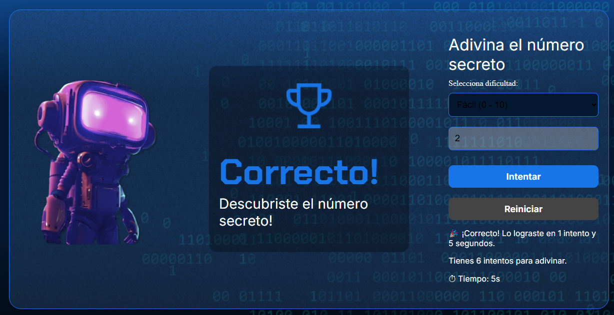

# 🎯 Descubre el Número Secreto

Un pequeño juego hecho con HTML, CSS y JavaScript hecho para mejorar habilades de lógica en programación.
¡Pon a prueba tu intuición y descubre el Número Secreto!

---

## 🖼 Vista previa. [Jugar en Vercel](https://sumergete-con-js.vercel.app/)



---

## 🕹 Cómo jugar

1. Selecciona una dificultad:
   - Fácil (0 - 10)
   - Intermedio (0 - 100)
   - Avanzado (0 - 1000)
2. Escribe un número dentro del rango elegido.
3. Haz clic en **Intentar**.
4. Tienes **7 intentos** para adivinar el número secreto.
5. Si aciertas, ¡ganas! Si no, el juego muestra el Número Incorrecto y puedes reiniciar.

---

## 🚀 Tecnologías utilizadas

- HTML5
- CSS3
- JavaScript

---

## 📁 Estructura del proyecto

```text
adivina-numero/
├── index.html              # Página principal del juego
├── style.css               # Estilos del juego
├── app.js                  # Lógica del juego en JavaScript
├── README.md               # Instrucciones de la aplicación
└── img/                    # Carpeta de imágenes
    ├── robot.png
    ├── trophy.png
    ├── Ruido.png
    └── captura-juego.png   # Vista previa del juego
```
---

⚙️ Funcionalidades principales
- Selector de dificultad (0–10, 0–100, 0–1000)
- Mensajes dinámicos para aciertos, errores y pistas
- Temporizador de partida
- Reinicio de juego automático al cambiar dificultad o presionar "Reiniciar"
- Indicadores visuales de estado: correcto o incorrecto

---

🧠 Objetivo del proyecto

Este proyecto fue creado con el objetivo de afianzar conocimientos y práctica de lógica de programación en JavaScript. Está disponible para fines educativos, puedes modificarlo libremente.

---

📝 Notas

Asegúrate de tener todas las imágenes en la carpeta img/.
El juego es completamente funcional sin necesidad de servidor o dependencias externas.
Ideal para practicar lógica de programación y manipulación del DOM JavaScript.

---

✨ Créditos

Desarrollado como práctica de Lógica de programación con JavaScript del programa ONE - Oracle Next Education G9.

---


